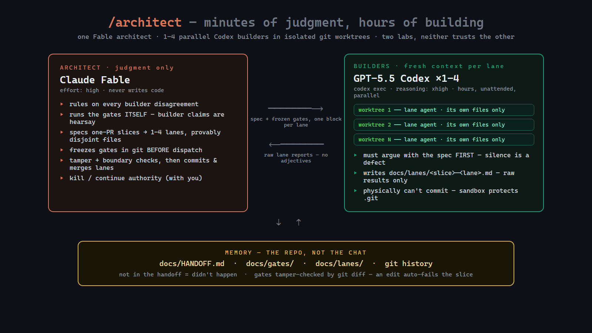

# architect-loop

**Claude Fable is your architect. GPT-5.5 Codex is your builder. The repo is the
only memory.** Two Claude Code skills that run the cross-vendor agent loop on
flat-rate subscriptions — no API keys, no token bills.

> Fable thinks, Codex builds, the repo remembers, you judge.

---

## Install (30 seconds)

```bash
git clone https://github.com/DanMcInerney/architect-loop
cd architect-loop && ./install.sh        # Windows: .\install.ps1
npm i -g @openai/codex@latest            # the builder (Codex CLI >= 0.133)
```

That's it. `./install.sh --project` installs to the current repo only instead
of globally. You need [Claude Code](https://claude.com/claude-code) on any paid
plan and the Codex CLI signed into a ChatGPT plan.

## Use (two commands)

In any repo, inside Claude Code:

```
/architect
```

**The main event.** One short Fable session per work block: it judges the last
run's evidence against frozen gates, splits the next one-PR slice into 1–4
lanes with disjoint file sets, and dispatches **one fresh `codex exec` builder
per lane, each in its own git worktree, all in parallel** — then reviews,
commits, and merges each lane when they finish. Builders run unattended for
hours; Fable's judgment costs minutes.

```
/architect-research <what you're thinking about building>
```

…when you're **brainstorming or picking a technology** first. Fans out
parallel Codex web-researchers across six lanes, verifies every claim against
sources, and writes a cited, decision-oriented report to `docs/research/`
that feeds the build loop's PRD.

---

## How it works in one picture



One architect session per work block: **rule on disagreements → judge the last
run's raw evidence against frozen gates → split the next slice into 1–4 lanes
with disjoint file sets → freeze gates, commit, dispatch → per-lane tamper +
boundary checks → commit, merge, smoke-run gates → verdict next session →
main.** (Optional first step when you're still deciding what to build:
`/architect-research` feeds the PRD.)

**Who does what:**

| | Model | Effort | Job |
|---|---|---|---|
| Architect | Claude Fable | `high` (pinned by the skill) | judgment only: arbitration, judging evidence, lane-splitting, review + merge, kill/continue |
| Builders | 1–4 parallel GPT-5.5 `codex exec` agents, one git worktree each | `xhigh` (architect may dial per lane) | implementation, hours at a time, unattended, own files only |
| Researchers | GPT-5.5 via `codex exec -c web_search="live"` | `high` | gathering only — never recommendations |
| Memory | the repo | — | `docs/HANDOFF.md`, `docs/gates/`, `docs/lanes/`, `docs/research/`, git history |
| You | human | — | read the handoff between blocks; kill/continue authority |

## Why this shape works

Every serious source on agent harnesses — Anthropic's harness-engineering
posts, the most-installed community skills, the reward-hacking literature —
converged on the same four moves, and this loop enforces all of them
mechanically:

1. **Not in `docs/HANDOFF.md` = didn't happen.** State lives in the repo, not
   the chat. That's why 5 minutes of architect time per block is enough.
2. **Gates freeze before results exist.** Acceptance criteria are committed to
   `docs/gates/` *before* dispatch; a builder edit to any gate file (caught by
   `git diff`) fails the slice automatically. No goalpost-moving, by
   construction.
3. **Nobody grades their own work.** The builder reports raw numbers only;
   the architect runs the gate commands itself; cross-model review for
   high-stakes slices. Different models from different labs = no same-model
   sycophancy.
4. **Disagreement is mandatory.** The builder must challenge the spec (citing
   real files) before writing code — silent compliance is a defect. The
   architect rules on every disagreement: ACCEPT / REJECT / MODIFY + why.
5. **Fresh context per lane, worktree isolation between lanes.** Every lane
   is a new Codex process in its own git worktree — no context rot, no file
   collisions, and builders physically can't commit (the sandbox protects
   `.git`), so nothing reaches a branch until the architect's checks pass.
   If a lane breaks: discard the worktree, re-dispatch. Code is cheap;
   rescue prompting isn't.

The economics: judgment minutes on the expensive model, typing hours on the
flat-rate one. Both halves run on subscriptions you already have.

## The optional research skill

`/architect-research` is the discovery-scale companion for when you're still
deciding *what* to build: six parallel Codex web-researcher lanes (academic,
popular repos, cutting-edge repos, production patterns, general web, expert
opinion), ≥2 independent sources per load-bearing claim, citations only from
URLs actually fetched. Fable verifies and writes one cited, decision-oriented
report to `docs/research/` that feeds `/architect`'s PRD. Methodology details:
[skills/architect-research/SKILL.md](skills/architect-research/SKILL.md).

## What's in the box

| File | What it is |
|---|---|
| [DESIGN.md](DESIGN.md) | **The design document** — 12 enforced rules, failure-mode table, ~40 cited sources |
| [skills/architect/SKILL.md](skills/architect/SKILL.md) | The architect role: hard rules + procedure |
| [skills/architect/dispatch.md](skills/architect/dispatch.md) | Verified `codex exec` commands + the PHASE 0/1/2 builder block |
| [skills/architect/research.md](skills/architect/research.md) | Slice-scale inline fact-check fan-out |
| [skills/architect/HANDOFF.template.md](skills/architect/HANDOFF.template.md) | The repo-memory file the builder maintains |
| [skills/architect-research/SKILL.md](skills/architect-research/SKILL.md) | Discovery research: brief → plan → fan-out → verify → synthesize |
| [skills/architect-research/lanes.md](skills/architect-research/lanes.md) | Per-lane researcher prompts with verified endpoints |

## FAQ

**Do I need API keys?** No. Claude Code runs on your Claude plan; Codex CLI on
your ChatGPT plan. (Optional: `CODEX_API_KEY` per-token billing for overnight
runs that must not hit subscription rate windows.)

**What does a builder run cost?** It draws on your ChatGPT plan's 5-hour and
weekly quotas. Community reference points: a 6.5-hour autonomous run ≈ 20% of
a $100-tier weekly quota.

**What if the builder wrecks the repo?** One slice per run + a commit per lane
means `git reset` to the freeze commit and re-dispatch. The handoff records
what went wrong so the next spec avoids it.

**Can I watch the builder work?** Yes — `/architect` always prints the builder
block, so instead of the background dispatch you can paste it into an
interactive `codex` session prefixed with `/goal` and babysit the run.

**Why two skills?** Research-grade fan-out costs ~15× chat-level tokens — it
should be a deliberate act, not a side-effect of the build loop. `/architect`
still does small inline fact-checks on its own.

**Where do the rules come from?** [DESIGN.md](DESIGN.md) — every rule cites
its source (Anthropic engineering, the Fable prompting guide, verified Codex
CLI docs, superpowers, the Ralph loop, the reward-hacking literature).

## License

MIT
